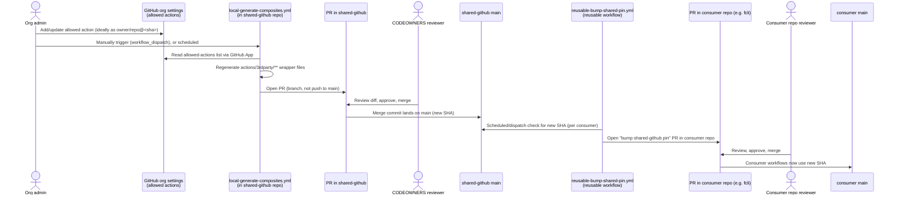

# Hardening plan: secure, consolidated distribution of shared CI building blocks

## Status

Draft. Not yet implemented. This document describes the target process and the
concrete changes needed to get there. It supersedes the current direct-push
model used by `generate-composites.yml`.

## Progress

Checklist mirrors the `## Sequencing` steps below; sub-items under Step 2
mirror the numbered subsections in `## Required changes in the shared repo`.
Keep this updated as work lands — check items off in the same PR/commit that
completes them.

- [x] **Step 1 — Rename & move**
  - [x] Repo renamed on GitHub: `3rdparty-actions` → `shared-github` (old name
        auto-redirects)
  - [x] Directory structure updated: `actions/3rdparty/`, `actions/fortify/`
  - [x] Reusable workflows/actions moved in from the `.github` repo
        (`reusable-check-duplicate-run.yml`, `reusable-fortify-analysis.yml`,
        `actions/fortify/update-tag`)
  - [x] `local-generate-composites.yml` updated to the PR-based flow + inline
        scoped-diff check
  - [x] `generate.js` updated: output dir now configurable via `OUTPUT_DIR`
        (default `actions/3rdparty`), passed from the workflow's job-level `env:`
  - [x] `README.md` updated to reflect the new output path
  - [ ] TODO: rename local clone/workspace folder to `shared-github` (GitHub
        side is done; local folder name is cosmetic only, not urgent)
- [ ] **Step 2 — Harden `shared-github`**
  - [x] `CODEOWNERS` added (`@fortify/shared-github-maintainers`, covering
        `/actions/3rdparty/`, `/actions/fortify/`, `/.github/workflows/`,
        `/scripts/`)
  - [X] Branch ruleset `protect-main` created
  - [X] Confirm bypass list on the ruleset is empty (no admin/owner override)
  - [ ] Confirm least-privilege GitHub App scoping (org-level allow-list read
        only, no repo `contents`/`pull_requests` permissions)
  - [ ] Alerting on push-to-`main` / merged PRs (not started)
  - [ ] TODO: Set `protect-main` ruleset to 'enforced'
  - [ ] TODO: update GitHub org config (`Allow or block specified actions and
        reusable workflows`) to require actions be referenced by commit SHA
        only, no version tags/branches — and reusable workflows too, if the
        org settings support restricting those to SHA references as well
        (double-check; this may only apply to actions)
- [x] **Step 3 — Add `reusable-bump-shared-pin.yml` reusable workflow**
  - [x] `.github/workflows/reusable-bump-shared-pin.yml` added, callable via `workflow_call`
  - [ ] TODO: validate manually against a fork/test consumer repo before rolling
        out to `fcli` (Step 4)
  - Note: it only bumps references already pinned to a 40-hex-char commit SHA
    (`.../shared-github/...@<sha>`); it does not touch `@main`/`@v1`/branch or
    tag refs. A consumer's first conversion from `@main` to a SHA (Step 5) must
    happen manually/once before this workflow has anything to bump for that
    reference.
- [ ] **Step 4 — Roll out consumer-side `bump-shared-github.yml` to `fcli`** (not started)
  - [ ] TODO:
- [ ] **Step 5 — Migrate `@main` references in `fcli` (and other consumers) to
      pinned SHAs against `shared-github`'s new paths** (not started)
  - [ ] TODO:
- [ ] **Step 6 — Remove now-unused workflows/actions from `.github`** (not
      started; `shared-github` currently duplicates them, `.github` originals
      still in place)
  - [ ] TODO:

## Target repo & layout

`3rdparty-actions` is renamed to **`shared-github`** (GitHub auto-redirects the
old name). Within it:

```
shared-github/
  actions/3rdparty/<owner>/<repo>/v<major>/action.yml   # generated wrapper actions
  actions/fortify/update-tag/action.yml                 # hand-written, org-owned actions
  .github/workflows/*.yml                               # reusable workflows (see note)
  scripts/generate.js
```

- **`actions/3rdparty/`** — replaces the old top-level `actions/` dir; holds
  only generator-produced wrapper actions around allowed 3rd-party actions.
- **`actions/fortify/`** — replaces `.github/actions/...` for hand-written,
  org-owned actions that aren't generated. Anything under here is maintained
  by hand and reviewed like normal source code.
- **`.github/workflows/`** — reusable *workflows* (as opposed to actions)
  **must** stay here: GitHub only resolves both triggerable and
  `workflow_call`-reusable workflow files from `.github/workflows/` in the
  repository root — there is no way to relocate them under `actions/` or
  anywhere else. This is the one exception to "own stuff lives under
  `actions/fortify/`". Since GitHub doesn't support subdirectories here, a
  **filename prefix** is used instead to tell the two kinds apart:
  `reusable-*.yml` for workflows whose only trigger is `workflow_call` (meant
  to be called from other repos), `local-*.yml` for workflows that run for
  this repo itself (e.g. `local-generate-composites.yml`, triggered by
  `workflow_dispatch`). The `name:` field mirrors the same prefix
  (`'Reusable: <title>'` / `'Local: <title>'`) so the two kinds are also
  grouped/recognizable in the GitHub Actions UI, which lists runs by `name:`
  rather than filename.

This consolidates what today are two repos (`3rdparty-actions` and hand-written
bits of `.github`) into one, so a consumer tracks a **single** commit SHA for
every shared CI building block it uses.

## Problem statement

Consumer workflows (e.g. `fcli`) reference two different repos at `@main`:

- `fortify/3rdparty-actions/actions/<owner>-<repo>/v<major>@main` — generated
  wrapper actions around allowed 3rd-party actions.
- `fortify/.github/.github/workflows/*.yml@main` and
  `fortify/.github/.github/actions/update-tag@main` — hand-written reusable
  workflows/actions.

Both repos are trusted at `@main`, a mutable ref. Today, `generate-composites.yml`
pushes generated changes to `3rdparty-actions` `main` directly, with no review
step. That means:

- Write access (or a compromised `GH_APP_ID`/`GH_APP_PRIVATE_KEY` secret, or a
  compromised `generate.js` dependency) on `3rdparty-actions` translates
  **instantly and silently** into arbitrary code execution in every consumer
  workflow across the org, including workflows that hold `secrets.GITHUB_TOKEN`
  with write scope, npm/release tokens, signing keys, etc.
- The same is true, separately, for `.github`, which is hand-maintained and has
  no generator in the loop at all today, but is *also* referenced at `@main`.
- Two repos means two separate places to harden, and two independent SHAs for
  consumers to track/bump.

## Goals

1. Never let an automated push (or a single compromised credential) reach a
   consumer workflow without a human-reviewable diff in between.
2. Consolidate `3rdparty-actions` and `.github`'s reusable workflows/actions
   into one repo (`shared-github`), with a clear directory split
   (`actions/3rdparty/` generated, `actions/fortify/` hand-written,
   `.github/workflows/` reusable workflows), so a consumer only tracks
   **one** commit SHA for all shared CI building blocks.
3. Keep the "admin updates the org allow-list → wrappers update automatically"
   experience, just gated by review instead of being instant.
4. Keep changes low-maintenance: consumers should not need to hand-edit SHAs;
   bumps should arrive as a bot-authored PR they merge.

## Target process overview



Key property: **two independent human-reviewed merges** stand between "admin
changes the allow-list" and "a consumer workflow executes new shared code" —
one in the shared repo, one in the consumer repo. Both are normal PR reviews,
so the process stays fully within existing GitHub workflows (no new tooling
for reviewers to learn).

### Authentication model (kept intentionally minimal)

Only **one** GitHub App is needed, installed on the org, used **exclusively**
to read `GET /orgs/{org}/actions/permissions/selected-actions` (an org-admin-level
read that `GITHUB_TOKEN` can never do). Every PR — both the generator's PR in
`shared-github` and each consumer's pin-bump PR — is opened with that job's
ordinary `GITHUB_TOKEN`, granted `contents: write` + `pull-requests: write` via
the workflow's `permissions:` block. No per-consumer App installation or extra
repo secret is required: the bump workflow runs via `workflow_call` *inside*
each consumer repo's own workflow, so its `GITHUB_TOKEN` is already scoped to
that repo.

Caveat: a PR opened with `GITHUB_TOKEN` does not trigger other
`pull_request`-triggered workflows (GitHub's anti-recursion rule for the
default token). Required **reviews** on the PR are unaffected (branch
protection enforces those regardless of who opened the PR), but a required
**status check** implemented as a separate `pull_request`-triggered workflow
won't fire on the bot's own PR. The scoped-diff validation below is therefore
run as part of the generator job itself (failing the job, and so never even
pushing a branch, if the diff is out of scope) rather than as a separate
required check — see "Scoped generator diff" for the concrete implementation.

## Required changes in the shared repo (`shared-github`)

### 1. Generator opens a PR instead of pushing to `main`

Replace the final step of `local-generate-composites.yml`. The job's
`permissions:` block grants `contents: write` and `pull-requests: write` on
`GITHUB_TOKEN`; the App token is used *only* for `fetchAllowedActions`, never
for git operations:

```yaml
jobs:
  generate:
    runs-on: ubuntu-latest
    permissions:
      contents: write
      pull-requests: write

    steps:
      - name: Checkout
        uses: actions/checkout@v6
      # ...existing setup-node / npm ci / run generator steps, unchanged...
      # generator now writes wrappers under actions/3rdparty/** instead of top-level actions/**

      - name: Verify generated diff stays within actions/3rdparty/**
        run: |
          out_of_scope=$(git status --porcelain | awk '{print $2}' | grep -v '^actions/3rdparty/' || true)
          if [ -n "$out_of_scope" ]; then
            echo "::error::Generator touched files outside actions/3rdparty/**:"
            echo "$out_of_scope"
            exit 1
          fi

      - name: Commit changes to branch
        env:
          GIT_AUTHOR_NAME: github-actions[bot]
          GIT_AUTHOR_EMAIL: github-actions[bot]@users.noreply.github.com
        run: |
          git config user.name "$GIT_AUTHOR_NAME"
          git config user.email "$GIT_AUTHOR_EMAIL"
          git checkout -b "chore/update-generated-actions-${{ github.run_id }}"
          git add -A
          if git diff --cached --quiet; then
            echo "has_changes=false" >> "$GITHUB_OUTPUT"
          else
            git commit -m "chore: update generated composite actions"
            git push origin "HEAD:chore/update-generated-actions-${{ github.run_id }}"
            echo "has_changes=true" >> "$GITHUB_OUTPUT"
          fi
        id: commit

      - name: Open pull request
        if: steps.commit.outputs.has_changes == 'true'
        env:
          GH_TOKEN: ${{ github.token }}
        run: |
          gh pr create \
            --title "chore: update generated composite actions" \
            --body "Automated regeneration of wrapper actions from the org allow-list. Review the diff for any unexpected upstream/ref changes before merging." \
            --base main \
            --head "chore/update-generated-actions-${{ github.run_id }}"
```

The out-of-scope check runs *before* anything is pushed, so a generator bug
(or a compromised `generate.js`) can never even produce a branch/PR outside
`actions/3rdparty/**` — the job simply fails. `GITHUB_TOKEN` is scoped to this
repo by the `permissions:` block and is sufficient for both the push and
`gh pr create`; the org-level App token is only ever used earlier, inside
`generate.js`, to read the allow-list.

### 2. Scoped generator diff (defense in depth)

Because a bot-opened PR can't rely on a separate required `pull_request` check
(see auth model above), the generator job validates its own diff **before**
pushing the branch or opening the PR: after running `generate.js`, the changed
paths must all be under `actions/3rdparty/**`; the job fails (no branch
pushed, no PR opened) otherwise. This limits the blast radius of a
compromised `generate.js` (e.g. via a compromised npm dependency) to "can
propose a bad wrapper", not "can rewrite CI or hand-written actions" — the
generator process is structurally incapable of touching
`.github/workflows/**`, `actions/fortify/**`, or `scripts/**`.

### 3. Branch protection on `main`

Implemented as a repository ruleset named **`protect-main`** (GitHub Settings →
Rules → Rulesets), targeting the default branch:

- Require pull request before merging (no direct pushes, including for admins
  if the plan allows).
- Require at least 1 (ideally 2) approving review.
- Require any existing CI checks to pass (the scoped-diff validation runs
  inside the generator job itself, so there is nothing extra to mark
  "required" for that specific safeguard — see the authentication model note
  above).
- Require review from Code Owners.
- Dismiss stale approvals on new commits.
- Restrict deletions, block force pushes.
- Bypass list: empty (nobody bypasses, not even admins).

> **Status:** ruleset created, **not yet set to Active/enforced** — see
> `## Progress`.

### 4. `CODEOWNERS`

```
# Generated wrappers: any change must be reviewed even though it's automated
/actions/3rdparty/    @fortify/shared-github-maintainers

# Hand-written, org-owned actions
/actions/fortify/     @fortify/shared-github-maintainers

# Reusable workflows (must stay under .github/workflows per GitHub platform requirement)
/.github/workflows/   @fortify/shared-github-maintainers

/scripts/             @fortify/shared-github-maintainers
```

(adjust team name to whichever group should own this repo)

### 5. Least-privilege GitHub App

The single App backing `GH_APP_ID`/`GH_APP_PRIVATE_KEY` is scoped to:

- Org permission `organization_administration: read` (or the narrowest
  permission that allows reading `GET /orgs/{org}/actions/permissions/selected-actions`)
  — this is its only job.
- No `contents`/`pull_requests` repo permissions at all: the generator job
  uses the installation token only for the allow-list read, then uses the
  workflow's own `GITHUB_TOKEN` (scoped by the job's `permissions:` block) for
  the git push and `gh pr create`.
- No access to any repo other than what's needed for the org-level API call
  (Apps only need an org installation for org-level endpoints, not a repo
  installation).

No second App is needed for consumer repos — see the authentication model
note above.

### 6. Alerting

Add a notification (Slack webhook or similar) on:
- Any push event to `main` (should never happen once branch protection is on
  — an alert here means protection was bypassed).
- Any merged PR (normal signal, lower urgency, but gives visibility into
  cadence/reviewer diligence).

## New reusable workflow: pin bump for consumer repos

Add `.github/workflows/reusable-bump-shared-pin.yml` in `shared-github`, callable via
`workflow_call`, that:

1. Resolves `shared-github`'s current `main` SHA.
2. Opens a PR in the **consumer repo** that updates all
   `fortify/shared-github/...@<sha>` references (across `actions/3rdparty/**`,
   `actions/fortify/**`, and `.github/workflows/**` paths alike) to that new
   SHA.
3. Uses a search/replace across `.github/workflows/**/*.yml` for the pattern
   `fortify/shared-github/` followed by a 40-hex-char SHA — this is what makes
   "one commit SHA, one bump PR" possible even though the shared repo has many
   independent paths and workflow files.

```yaml
name: Bump shared-github pin

on:
  workflow_call:
    inputs:
      shared-repo:
        type: string
        default: fortify/shared-github

jobs:
  bump:
    runs-on: ubuntu-latest
    permissions:
      contents: write
      pull-requests: write
    steps:
      - uses: actions/checkout@v6

      - name: Resolve latest shared-github main SHA
        id: latest
        env:
          GH_TOKEN: ${{ github.token }}
        run: |
          sha=$(gh api "repos/${{ inputs.shared-repo }}/commits/main" --jq .sha)
          echo "sha=$sha" >> "$GITHUB_OUTPUT"

      - name: Update pinned SHA references
        id: update
        run: |
          repo="${{ inputs.shared-repo }}"
          new_sha="${{ steps.latest.outputs.sha }}"
          changed=0
          while IFS= read -r -d '' f; do
            if grep -qE "${repo}/[^@]+@[0-9a-f]{40}" "$f"; then
              sed -i -E "s#(${repo}/[^@[:space:]]+@)[0-9a-f]{40}#\1${new_sha}#g" "$f"
              changed=1
            fi
          done < <(find .github/workflows -name '*.yml' -print0)
          echo "changed=$changed" >> "$GITHUB_OUTPUT"

      - name: Open pull request
        if: steps.update.outputs.changed == '1'
        env:
          GH_TOKEN: ${{ github.token }}
        run: |
          git config user.name "github-actions[bot]"
          git config user.email "github-actions[bot]@users.noreply.github.com"
          git checkout -b "chore/bump-shared-github-${{ steps.latest.outputs.sha }}"
          git commit -am "chore: bump shared-github pin to ${{ steps.latest.outputs.sha }}"
          git push origin HEAD
          gh pr create \
            --title "chore: bump shared-github pin to ${{ steps.latest.outputs.sha }}" \
            --body "Updates all fortify/shared-github references to the latest reviewed commit on main." \
            --base main
```

`GITHUB_TOKEN` here is the *caller* (consumer repo's) token — since this
workflow runs via `workflow_call` from inside the consumer's own workflow, the
token is already scoped to that repo; no secret needs to be passed in at all.

(Illustrative — exact SHA/regex handling needs testing, and inputs should also
cover the old `fortify/3rdparty-actions` / `fortify/.github` prefixes during
the migration window until all references move to the consolidated repo.)

## Consumer repo workflow

Each consumer repo (e.g. `fcli`) adds a small workflow that calls the reusable
bump workflow on a schedule:

```yaml
# .github/workflows/bump-shared-github.yml
name: Bump shared-github pin

on:
  schedule:
    - cron: '0 6 * * 1'   # weekly
  workflow_dispatch: {}

permissions:
  contents: write
  pull-requests: write

jobs:
  bump:
    uses: fortify/shared-github/.github/workflows/reusable-bump-shared-pin.yml@<pinned-sha>
```

Notes:
- The `uses:` line for the reusable workflow itself is pinned to a SHA, not
  `@main` — bootstrapping trust: the very first adoption is pinned by hand,
  after which the bot's own PRs keep it current, same as any other reference.
- No repo secret is needed: the caller workflow's `permissions:` block grants
  its own `GITHUB_TOKEN` `contents: write` + `pull-requests: write`, which is
  passed through to the called reusable workflow automatically.
- The resulting bump PR still requires normal review/merge in the consumer
  repo per its existing branch protection — no special-casing needed.

## Migration of existing references

Once `shared-github` exists with its final layout, update consumers (starting
with `fcli`, which currently has the most references):

- `fortify/.github/.github/workflows/check-duplicate-run.yml@main` →
  `fortify/shared-github/.github/workflows/reusable-check-duplicate-run.yml@<sha>`
- `fortify/.github/.github/workflows/fortify-analysis.yml@main` →
  `fortify/shared-github/.github/workflows/reusable-fortify-analysis.yml@<sha>`
- `fortify/.github/.github/actions/update-tag@main` →
  `fortify/shared-github/actions/fortify/update-tag@<sha>`
- `fortify/3rdparty-actions/actions/<owner>/<repo>/v<major>@main` →
  `fortify/shared-github/actions/3rdparty/<owner>/<repo>/v<major>@<sha>`

All four collapse to the same SHA once consolidated, so future bumps touch one
value across the whole workflow file.

## Sequencing

Start with the rename and directory move — it's a low-risk, purely structural
change (existing consumers keep working unchanged via `@main` until the
migration step later), and gets the target layout in place before layering
security controls on top of it.

1. **Rename & move first:**
   - Rename `3rdparty-actions` → `shared-github` (GitHub auto-redirects the
     old name and old `@main` references keep working during the transition).
   - Move `actions/<owner>/<repo>/v<major>` → `actions/3rdparty/<owner>/<repo>/v<major>`
     in the generator output and update `local-generate-composites.yml`/`generate.js`
     accordingly (output dir, cleanup step, README).
   - Move `.github/actions/update-tag` (from the `.github` repo) →
     `actions/fortify/update-tag` in `shared-github`.
   - Move `.github/workflows/check-duplicate-run.yml` and
     `.github/workflows/fortify-analysis.yml` (from the `.github` repo) →
     `shared-github/.github/workflows/reusable-check-duplicate-run.yml` and
     `shared-github/.github/workflows/reusable-fortify-analysis.yml`
     (unchanged relative location, since workflows can't move out of
     `.github/workflows`; renamed with a `reusable-` prefix per the naming
     convention above).
   - Do this as a single reviewed PR. No hardening/branch-protection changes
     yet — just get the structure right.
2. Harden `shared-github` (branch protection, CODEOWNERS using the new paths,
   PR-based generator with the `3rdparty/**`-scoped diff check).
3. Add the `reusable-bump-shared-pin.yml` reusable workflow + validate manually against
   a fork/test consumer repo.
4. Roll out the consumer-side `bump-shared-github.yml` workflow to `fcli`
   first (highest reference count; just adds the workflow file with its
   `permissions:` block, no new secrets/App to provision), verify the
   resulting PR looks correct end to end, then roll out to remaining
   consumers.
5. Update all `@main` references in `fcli` (and other consumers) to pinned
   SHAs pointing at `shared-github`'s new paths.
6. Remove the now-unused workflows/actions from `.github`.

## Open questions

- Whether `main` should block direct pushes for org owners too, or just
  non-admin collaborators (GitHub's "Do not allow bypassing" setting).
- Cadence for the consumer bump workflow (schedule vs. triggered by a
  repository_dispatch from the shared repo on merge — the latter is faster
  but adds coupling; start with schedule + manual `workflow_dispatch`).
