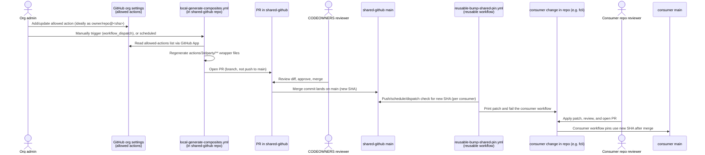

# Hardening plan: secure, consolidated distribution of shared CI building blocks

## Status

Implementation in progress. The repository rename, layout, generator hardening,
shared workflows, and initial consumer migrations are complete. Remaining work
is primarily organization configuration and migration of the remaining consumer
repositories.

## Progress

Checklist mirrors the `## Sequencing` steps below; sub-items under Step 2
mirror the numbered subsections in `## Required changes in the shared repo`.
Keep this updated as work lands — check items off in the same PR/commit that
completes them.

- [x] **Step 1 — Rename & move**
  - [x] Repo renamed on GitHub: `3rdparty-actions` → `shared-github` (old name
        auto-redirects)
  - [x] Directory structure updated: `actions/3rdparty/`, `actions/fortify/`
  - [x] Reusable workflows/actions moved in from the `.github` repo
        (`reusable-check-duplicate-run.yml`, `reusable-fortify-analysis.yml`,
        `actions/fortify/update-tag`)
  - [x] `local-generate-composites.yml` updated to the PR-based flow + inline
        scoped-diff check, split into a least-privilege `generate` job
        (`contents: read` only) and an `open-pr` job (`contents: write` +
        `pull-requests: write`) that consumes an artifact from `generate` —
        the generator and its npm deps never hold a token that can push/PR
  - [x] Fixed: first live run failed at the PR-creation step with
        `Resource not accessible by integration (createPullRequest)` — root
        cause was the job's `permissions:` block missing `pull-requests: write`
        entirely (only had `contents: write`); now present on the `open-pr` job
  - [x] `generate.js` updated: output dir now configurable via `OUTPUT_DIR`
        (default `actions/3rdparty`), passed from the workflow's job-level `env:`
  - [x] `README.md` updated to reflect the new output path
  - [x] Local workspace is now `shared-github`
- [ ] **Step 2 — Harden `shared-github`**
  - [x] `CODEOWNERS` added (`@fortify/shared-github-maintainers`, covering
        `/actions/3rdparty/`, `/actions/fortify/`, `/.github/workflows/`,
        `/scripts/`)
  - [X] Branch ruleset `protect-main` created
  - [X] Confirm bypass list on the ruleset is empty (no admin/owner override)
    - [ ] Confirm least-privilege GitHub App scoping (org-level allow-list read
      only, no repo `contents`/`pull_requests` permissions)
  - [ ] Alerting on push-to-`main` / merged PRs (not started)
  - [ ] TODO: Set `protect-main` ruleset to 'enforced'
  - [ ] TODO: update GitHub org config (`Allow or block specified actions and
        reusable workflows`) to require actions be referenced by commit SHA
        only, no version tags/branches — and reusable workflows too, if the
        org settings support restricting those to SHA references as well
        (double-check; this may only apply to actions)
    - [ ] TODO: add allow-list update detection so an already-allowed SHA can
      produce a proposed replacement even when the org allow-list has not
      changed; see `## Allow-list update proposals` below
- [x] **Step 3 — Add `reusable-bump-shared-pin.yml` reusable workflow**
  - [x] Added as a `workflow_call` reusable workflow
  - [x] Changed to read-only patch generation because `GITHUB_TOKEN` cannot
    modify files under `.github/workflows/`
  - [x] Job summary contains copy/pasteable `git apply` instructions and the
    workflow fails visibly when a pin update is needed
  - [x] Caller workflows support `schedule`, manual dispatch, push, and typed
    `repository_dispatch` triggers
- [x] **Step 4 — Roll out consumer-side `bump-shared-github.yml`**
  - [x] Added to `fcli`, `fcli-docker`, `tool-definitions`, and
    `shared-doc-resources`
  - [x] These workflows run on every push, daily, manually, and on
    `repository_dispatch` type `shared-github-updated`
- [x] **Step 5 — Migrate initial consumers to pinned `shared-github` SHAs**
  - [x] `fcli`
  - [x] `fcli-docker`
  - [x] `tool-definitions`
  - [ ] Parser plugins and other remaining Fortify repositories
    (including `fortify-ssc-parser-faa`, `fortify-ssc-parser-sarif`, and
    `fortify-ssc-parser-util`)
- [x] **Step 6 — Remove now-unused workflows/actions from `.github`**
  - [x] Moved workflow/action copies are no longer present in the `.github`
    repository
  - [x] `shared-doc-resources` is resources-only and has no root workflows
  - [ ] Migrate remaining consumer repositories before deleting their old
    `shared-doc-resources`/`.github` references

## Target repo & layout

`3rdparty-actions` is renamed to **`shared-github`** (GitHub auto-redirects the
old name). Within it:

```
shared-github/
  actions/3rdparty/<owner>/<repo>/v<major>/action.yml   # generated wrapper actions
  actions/fortify/update-tag/action.yml                 # hand-written, org-owned actions
  .github/workflows/*.yml                               # reusable workflows (see note)
  scripts/generate.js
```

- **`actions/3rdparty/`** — replaces the old top-level `actions/` dir; holds
  only generator-produced wrapper actions around allowed 3rd-party actions.
- **`actions/fortify/`** — replaces `.github/actions/...` for hand-written,
  org-owned actions that aren't generated. Anything under here is maintained
  by hand and reviewed like normal source code.
- **`.github/workflows/`** — reusable *workflows* (as opposed to actions)
  **must** stay here: GitHub only resolves both triggerable and
  `workflow_call`-reusable workflow files from `.github/workflows/` in the
  repository root — there is no way to relocate them under `actions/` or
  anywhere else. This is the one exception to "own stuff lives under
  `actions/fortify/`". Since GitHub doesn't support subdirectories here, a
  **filename prefix** is used instead to tell the two kinds apart:
  `reusable-*.yml` for workflows whose only trigger is `workflow_call` (meant
  to be called from other repos), `local-*.yml` for workflows that run for
  this repo itself (e.g. `local-generate-composites.yml`, triggered by
  `workflow_dispatch`). The `name:` field mirrors the same prefix
  (`'Reusable: <title>'` / `'Local: <title>'`) so the two kinds are also
  grouped/recognizable in the GitHub Actions UI, which lists runs by `name:`
  rather than filename.

This consolidates what today are two repos (`3rdparty-actions` and hand-written
bits of `.github`) into one, so a consumer tracks a **single** commit SHA for
every shared CI building block it uses.

## Problem statement

Historically, consumer workflows (e.g. `fcli`) referenced two different repos
at `@main`; the initial migration has moved `fcli`, `fcli-docker`, and
`tool-definitions` to pinned `shared-github` references. Remaining consumers
still need migration:

- `fortify/3rdparty-actions/actions/<owner>-<repo>/v<major>@main` — generated
  wrapper actions around allowed 3rd-party actions.
- `fortify/.github/.github/workflows/*.yml@main` and
  `fortify/.github/.github/actions/update-tag@main` — hand-written reusable
  workflows/actions.

The remaining old references are mutable and need to be replaced with pinned
SHAs. The generator now opens a reviewed PR rather than pushing generated
changes directly, and consumer pin checks produce a separate patch for human
application. The original risk being addressed was:

- Write access (or a compromised `GH_APP_ID`/`GH_APP_PRIVATE_KEY` secret, or a
  compromised `generate.js` dependency) on `3rdparty-actions` translates
  **instantly and silently** into arbitrary code execution in every consumer
  workflow across the org, including workflows that hold `secrets.GITHUB_TOKEN`
  with write scope, npm/release tokens, signing keys, etc.
- The same is true, separately, for `.github`, which is hand-maintained and has
  no generator in the loop at all today, but is *also* referenced at `@main`.
- Two repos means two separate places to harden, and two independent SHAs for
  consumers to track/bump.

## Goals

1. Never let an automated push (or a single compromised credential) reach a
   consumer workflow without a human-reviewable diff in between.
2. Consolidate `3rdparty-actions` and `.github`'s reusable workflows/actions
   into one repo (`shared-github`), with a clear directory split
   (`actions/3rdparty/` generated, `actions/fortify/` hand-written,
   `.github/workflows/` reusable workflows), so a consumer only tracks
   **one** commit SHA for all shared CI building blocks.
3. Keep the "admin updates the org allow-list → wrappers update automatically"
   experience, just gated by review instead of being instant.
4. Keep changes low-maintenance: consumers should not need to calculate SHAs;
  bump checks should produce a small, reviewable patch that a maintainer can
  apply and merge. Fully automatic PR creation remains a future option.

## Target process overview



Key property: the generated wrapper change is reviewed in `shared-github`
before it reaches `main`. Consumer pin checks then detect the new commit and
produce a separate, human-applied patch because the default `GITHUB_TOKEN`
cannot modify files under `.github/workflows/`. A future central dispatcher can
trigger those checks through the existing `repository_dispatch` trigger.

### Authentication model (kept intentionally minimal)

Only **one** GitHub App is needed for the current generator, installed on the
org and used **exclusively** to read
`GET /orgs/{org}/actions/permissions/selected-actions` (an org-admin-level read
that `GITHUB_TOKEN` cannot do). The generator's PR uses its job's ordinary
`GITHUB_TOKEN`. Consumer bump workflows are currently read-only and produce
patches; no per-consumer write App or extra secret is required.

Caveat: `GITHUB_TOKEN` cannot push changes to files under `.github/workflows/`.
That is why consumer pinning currently stops at a copy/pasteable patch and
fails visibly rather than opening a PR. If full automation is later required,
use a narrowly installed GitHub App with workflow-file write permission, with
branch protection and no ruleset bypass.

## Required changes in the shared repo (`shared-github`)

### 1. Generator opens a PR instead of pushing to `main`, split into least-privilege jobs

Implemented as two jobs in `local-generate-composites.yml`: `generate` runs the
generator itself (and its npm dependencies) with only `contents: read` — no
git-push or PR permissions at all, so a compromised `generate.js`/dependency
can produce a bad wrapper at worst, never push or open anything. It uploads
the regenerated `actions/3rdparty/**` tree as a build artifact. A second job,
`open-pr`, holds `contents: write` + `pull-requests: write` and runs no
generator code — only `git`/`gh` commands against the artifact `generate`
already produced and scope-checked:

```yaml
env:
  OUTPUT_DIR: actions/3rdparty

jobs:
  generate:
    runs-on: ubuntu-latest
    permissions:
      contents: read
    outputs:
      has_changes: ${{ steps.diff.outputs.has_changes }}
    steps:
      - name: Checkout
        uses: actions/checkout@v6
      # ...existing setup-node / npm ci / run generator steps, unchanged...
      # generator now writes wrappers under actions/3rdparty/** instead of top-level actions/**

      - name: Verify generated diff stays within actions/3rdparty/**
        id: diff
        run: |
          out_of_scope=$(git status --porcelain | awk '{print $2}' | grep -v '^actions/3rdparty/' || true)
          if [ -n "$out_of_scope" ]; then
            echo "::error::Generator touched files outside actions/3rdparty/**:"
            echo "$out_of_scope"
            exit 1
          fi
          if git status --porcelain -- "$OUTPUT_DIR" | grep -q .; then
            echo "has_changes=true" >> "$GITHUB_OUTPUT"
          else
            echo "has_changes=false" >> "$GITHUB_OUTPUT"
          fi

      - name: Upload generated wrapper actions
        if: steps.diff.outputs.has_changes == 'true'
        uses: actions/upload-artifact@v7
        with:
          name: generated-wrapper-actions
          path: ${{ env.OUTPUT_DIR }}
          retention-days: 1

  open-pr:
    needs: generate
    if: needs.generate.outputs.has_changes == 'true'
    runs-on: ubuntu-latest
    permissions:
      contents: write
      pull-requests: write
    steps:
      - name: Checkout
        uses: actions/checkout@v6

      - name: Remove existing wrapper actions
        run: rm -rf "$OUTPUT_DIR"

      - name: Download generated wrapper actions
        uses: actions/download-artifact@v8
        with:
          name: generated-wrapper-actions
          path: ${{ env.OUTPUT_DIR }}

      - name: Commit changes to branch
        env:
          GIT_AUTHOR_NAME: github-actions[bot]
          GIT_AUTHOR_EMAIL: github-actions[bot]@users.noreply.github.com
        run: |
          git config user.name "$GIT_AUTHOR_NAME"
          git config user.email "$GIT_AUTHOR_EMAIL"
          git checkout -b "chore/update-generated-actions-${{ github.run_id }}"
          git add -A
          git commit -m "chore: update generated composite actions"
          git push origin "HEAD:chore/update-generated-actions-${{ github.run_id }}"

      - name: Open pull request
        env:
          GH_TOKEN: ${{ github.token }}
        run: |
          gh pr create \
            --title "chore: update generated composite actions" \
            --body "Automated regeneration of wrapper actions from the org allow-list. Review the diff for any unexpected upstream/ref changes before merging." \
            --base main \
            --head "chore/update-generated-actions-${{ github.run_id }}"
```

The out-of-scope check runs *before anything is even archived*, so a
generator bug (or a compromised `generate.js`) can never even reach the
artifact handed to the privileged `open-pr` job — the `generate` job simply
fails. Note the check remains useful even though only `actions/3rdparty/**` is
archived: it's not just data-flow control but an alarm — if the generator ever
touches anything else, we want the run to fail loudly rather than silently
discard the unexpected change. `GITHUB_TOKEN` in `open-pr` is scoped to this
repo by its `permissions:` block and is sufficient for both the push and
`gh pr create`; the org-level App token is only ever used earlier, inside
`generate.js` (in the unprivileged `generate` job), to read the allow-list.

### 2. Scoped generator diff (defense in depth)

Because a bot-opened PR can't rely on a separate required `pull_request` check
(see auth model above), the `generate` job validates its own diff **before**
archiving anything for the `open-pr` job: after running `generate.js`, the
changed paths must all be under `actions/3rdparty/**`; the job fails (nothing
archived, no branch pushed, no PR opened) otherwise. This limits the blast
radius of a compromised `generate.js` (e.g. via a compromised npm dependency)
to "can propose a bad wrapper", not "can rewrite CI or hand-written actions" —
the generator process is structurally incapable of touching
`.github/workflows/**`, `actions/fortify/**`, or `scripts/**`, **and** it never
holds a token capable of pushing or opening a PR in the first place (that
token only exists in the separate `open-pr` job).

## Allow-list update proposals

### Current behavior

`generate.js` currently consumes the org allow-list as authoritative. It
resolves non-SHA refs and emits `WARNINGS.md`/workflow annotations, but it does
not compare an already-allowed SHA with a newer release in the same major
version. Therefore, when the allow-list remains unchanged, the generator has
no generated diff and no PR is opened. This is intentional for the current
implementation but means administrators must update the org allow-list before
the wrapper generator can adopt a newer upstream action commit.

### Proposed behavior

Add an explicit **allow-list update proposal** pass to `generate.js`:

1. For each allow-listed `owner/repo@<sha>`, resolve the commit's associated
   release tag where possible and determine the latest release tag in the same
   major version. Do not cross a major-version boundary.
2. Compare the allow-listed SHA with the commit SHA behind that latest tag.
3. For every newer candidate, write a machine-readable proposal containing:
   `owner/repo`, current allow-list SHA, current tag (if known), proposed tag,
   proposed SHA, and the exact allow-list replacement line:
   `owner/repo@<current-sha>` → `owner/repo@<proposed-sha>`.
4. Keep the generated wrapper update and proposal report together in the
   generator artifact/PR. The PR description must include a literal replacement
   list and explicitly state:
   **the corresponding entries in GitHub organization Actions settings must be
   updated at the same time as this PR is merged**.
5. If there are proposals but no wrapper diff, still create a PR containing
   only the proposal report so the required organization-setting change is
   reviewed and tracked. The report must not be committed outside the allowed
   generator scope without updating the scope policy; preferably place it in a
   dedicated generated path such as `actions/3rdparty/.metadata/` or pass it
   between jobs as a PR-body artifact.

### Safety and operational rules

- The generator must never silently change the effective upstream SHA merely
  because a newer tag exists; the org allow-list remains authoritative until
  an administrator updates it.
- A proposal is advisory and must not be treated as permission to execute the
  proposed action before the org setting is updated.
- Handle repositories with no tags, moving tags, non-semver tags, API failures,
  and commits whose tag association cannot be determined by reporting an
  explicit unresolved status rather than guessing.
- Use a deterministic ordering and stable report format so repeated daily runs
  do not create noisy PRs.
- The PR-generation job should include the proposal text but must not execute
  arbitrary generated content with write permissions.
- The workflow should avoid creating duplicate open proposal PRs for the same
  current/proposed SHA pair.

### 3. Branch protection on `main`

Implemented as a repository ruleset named **`protect-main`** (GitHub Settings →
Rules → Rulesets), targeting the default branch:

- Require pull request before merging (no direct pushes, including for admins
  if the plan allows).
- Require at least 1 (ideally 2) approving review.
- Require any existing CI checks to pass (the scoped-diff validation runs
  inside the generator job itself, so there is nothing extra to mark
  "required" for that specific safeguard — see the authentication model note
  above).
- Require review from Code Owners.
- Dismiss stale approvals on new commits.
- Restrict deletions, block force pushes.
- Bypass list: empty (nobody bypasses, not even admins).

> **Status:** ruleset created, **not yet set to Active/enforced** — see
> `## Progress`.

### 4. `CODEOWNERS`

```
# Generated wrappers: any change must be reviewed even though it's automated
/actions/3rdparty/    @fortify/shared-github-maintainers

# Hand-written, org-owned actions
/actions/fortify/     @fortify/shared-github-maintainers

# Reusable workflows (must stay under .github/workflows per GitHub platform requirement)
/.github/workflows/   @fortify/shared-github-maintainers

/scripts/             @fortify/shared-github-maintainers
```

(adjust team name to whichever group should own this repo)

### 5. Least-privilege GitHub App

The single App backing `GH_APP_ID`/`GH_APP_PRIVATE_KEY` is scoped to:

- Org permission `organization_administration: read` (or the narrowest
  permission that allows reading `GET /orgs/{org}/actions/permissions/selected-actions`)
  — this is its only job.
- No `contents`/`pull_requests` repo permissions at all: the generator job
  uses the installation token only for the allow-list read, then uses the
  workflow's own `GITHUB_TOKEN` (scoped by the job's `permissions:` block) for
  the git push and `gh pr create`.
- No access to any repo other than what's needed for the org-level API call
  (Apps only need an org installation for org-level endpoints, not a repo
  installation).

No second App is needed for consumer repos — see the authentication model
note above.

### 6. Alerting

Add a notification (Slack webhook or similar) on:
- Any push event to `main` (should never happen once branch protection is on
  — an alert here means protection was bypassed).
- Any merged PR (normal signal, lower urgency, but gives visibility into
  cadence/reviewer diligence).

## Reusable workflow: pin check and patch generation

`.github/workflows/reusable-bump-shared-pin.yml` is callable via
`workflow_call`. It resolves the latest `shared-github/main` SHA, replaces
already-pinned `fortify/shared-github/...@<sha>` references in the consumer's
workflow files, and compares the resulting tree with `git diff`.

When changes are needed, it writes a copy/pasteable diff and application
commands to the job summary, then fails. It does **not** push or open a PR:
GitHub's default `GITHUB_TOKEN` cannot modify files under `.github/workflows/`,
and the workflow deliberately avoids a broader App/PAT credential for now.
The human applies the displayed patch and opens the consumer PR.

The workflow only updates references already pinned to a 40-character commit
SHA. It deliberately leaves `@main`, tags, and branch refs untouched; initial
consumer migration to SHA-pinned `shared-github` references is a one-time
manual change.

## Consumer repo workflow

Each migrated consumer repo adds a small workflow that calls the reusable bump
workflow. Current consumers use daily, manual, push, and future central
`repository_dispatch` triggers:

```yaml
# .github/workflows/bump-shared-github.yml
name: Bump shared-github pin

on:
  schedule:
    - cron: '0 6 * * *'   # daily
  workflow_dispatch:
  push:
  repository_dispatch:
    types: [shared-github-updated]

permissions:
  contents: read

jobs:
  bump:
    uses: fortify/shared-github/.github/workflows/reusable-bump-shared-pin.yml@<pinned-sha>
```

Notes:
- The `uses:` line for the reusable workflow itself is pinned to a SHA, not
  `@main` — bootstrapping trust: the very first adoption is pinned by hand,
  after which the bot's own PRs keep it current, same as any other reference.
- The workflow is read-only and produces a patch rather than a PR. This avoids
  requiring a GitHub App with `Workflows: write` permission in every consumer.
- A central dispatcher can later send `repository_dispatch` with type
  `shared-github-updated`; no consumer workflow-file change is needed for that
  future fan-out mechanism.

## Migration of existing references

Initial migration is complete for `fcli`, `fcli-docker`, and
`tool-definitions`. Remaining migration includes the parser plugin repositories
and other Fortify repositories that still reference the old repositories or
mutable refs. The target mappings are:

- `fortify/.github/.github/workflows/check-duplicate-run.yml@main` →
  `fortify/shared-github/.github/workflows/reusable-check-duplicate-run.yml@<sha>`
- `fortify/.github/.github/workflows/fortify-analysis.yml@main` →
  `fortify/shared-github/.github/workflows/reusable-fortify-analysis.yml@<sha>`
- `fortify/.github/.github/actions/update-tag@main` →
  `fortify/shared-github/actions/fortify/update-tag@<sha>`
- `fortify/3rdparty-actions/actions/<owner>/<repo>/v<major>@main` →
  `fortify/shared-github/actions/3rdparty/<owner>/<repo>/v<major>@<sha>`

All shared-github references in a migrated consumer use the same commit SHA;
future checks therefore produce one patch covering that consumer's shared
workflow/action references.

## Sequencing and remaining work

Completed foundation:

1. Renamed the repository and established `actions/3rdparty/`,
  `actions/fortify/`, and the reusable/local workflow naming convention.
2. Moved the shared actions/workflows and added CODEOWNERS plus the generator's
  least-privilege two-job design.
3. Added the read-only patch-based pin checker and migrated `fcli`,
  `fcli-docker`, and `tool-definitions` to pinned shared-github references.
4. Removed the old moved workflow/action copies from the `.github` repository.

Remaining work:

1. Set the `protect-main` ruleset to Active/enforced and confirm the actual
  GitHub App/org allow-list configuration.
2. Migrate the remaining consumers, especially
  `fortify-ssc-parser-faa`, `fortify-ssc-parser-sarif`,
  `fortify-ssc-parser-util`, and other Fortify repositories still using the
  old shared repositories or mutable refs.
3. Decide whether to add a central dispatcher that sends
  `repository_dispatch` type `shared-github-updated` to an explicit list of
  migrated consumers. The consumer workflows already accept that event.
4. Decide whether to replace manual patch application with a narrowly scoped
  GitHub App/PAT that can create branches and modify workflow files. This is
  intentionally not enabled in the current implementation.
5. Add alerting for unexpected pushes to `shared-github` `main` and merged
  shared-code PRs.

## Open questions

- Whether `main` should block direct pushes for org owners too, or just
  non-admin collaborators (GitHub's "Do not allow bypassing" setting).
- Whether to implement the central `repository_dispatch` fan-out, and which
  repositories should be explicitly opted in.
